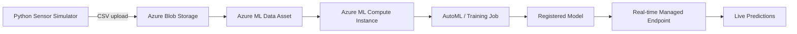

# IIoT Predictive Maintenance using Azure Machine Learning

Predicting industrial machine failure from simulated vibration, temperature, and pressure sensor data, using an end-to-end pipeline built on Microsoft Azure.

---

## 📌 Overview

This project simulates an Industrial IoT (IIoT) environment where multiple machines continuously report sensor readings. Instead of waiting for a machine to break down, this pipeline trains a classification model to **flag failure risk before it happens**, using Azure Machine Learning for training, evaluation, and deployment.

**Problem type:** Binary classification (`failure`: 0 = healthy, 1 = failure)
**Best model found:** Logistic Regression (MaxAbsScaler) — **AUC weighted: 0.9978**

---

## 🏗️ Architecture



| Stage | Azure Service Used |
|---|---|
| Data simulation | Python (local) |
| Data storage | Azure Blob Storage |
| ML workspace | Azure Machine Learning — `iiot-ml-workspace` |
| Model training compute | Compute Instance — `iiot-compute` |
| Model search | Automated ML (AutoML) job — `machine-sensor` |
| Monitoring | Application Insights |
| Resource organization | Resource Group — `iiot-predictive-maintenance-rg` |

---

## ⚙️ Azure Resources Used

| Resource | Details |
|---|---|
| Resource Group | `iiot-predictive-maintenance-rg` |
| ML Workspace | `iiot-ml-workspace` (region: East US) |
| Compute Instance | `iiot-compute` — Standard_DS1_v2 (1 core, 3.5 GB RAM, 7 GB disk), ~$0.07/hr, idle auto-shutdown after 1 hour |
| Application Insights | Auto-provisioned for endpoint monitoring |
| AutoML Job | `machine-sensor` — Classification task, target column `failure` |

> Compute costs and resource names above are included for documentation purposes only. No credentials, keys, or subscription identifiers are included in this repository — regenerate any keys before making a workspace public.

---

## 🧪 Model Results (AutoML)

The AutoML job evaluated multiple algorithms automatically. Top results ranked by AUC weighted:

| Algorithm | Scaler | AUC Weighted | Duration |
|---|---|---|---|
| **Logistic Regression** | MaxAbsScaler | **0.99782** | 1m 36s |
| Logistic Regression | MaxAbsScaler | 0.99767 | 54s |
| Extreme Random Trees | StandardScalerWrapper | 0.99764 | 58s |
| XGBoost Classifier | StandardScalerWrapper | 0.99744 | 56s |
| LightGBM | MaxAbsScaler | 0.99744 | 1m 38s |
| XGBoost Classifier | StandardScalerWrapper | 0.99739 | 1m 38s |

The best-performing model (Logistic Regression) was selected for deployment based on AUC weighted score, which balances performance across both the healthy and failure classes despite the class imbalance in the dataset (~6% failure readings).

---

## 📈 Results & Visualizations

| Sensor readings over time | Class balance |
|---|---|
|  |  |

| Confusion matrix | Feature importance |
|---|---|
|  |  |

---

## 📁 Repository Structure

```
iiot-predictive-maintenance/
│
├── README.md                  # This file
├── sensor_simulator.py        # Generates synthetic vibration/temperature/pressure data
├── train_model.py             # Trains and evaluates a classification model
├── predict_live.py            # Sends a live reading to the deployed endpoint for prediction
├── machine_sensor_data.csv    # Generated dataset (or link to it if too large for GitHub)
├── requirements.txt           # Python dependencies
└── docs/
    └── screenshots/
        ├── output_1_sensor_timeseries.png
        ├── output_2_class_balance.png
        ├── output_3_confusion_matrix.png
        └── output_4_feature_importance.png
```

---

## 🚀 How to Run This Project

### 1. Clone the repo
```bash
git clone https://github.com/<your-username>/iiot-predictive-maintenance.git
cd iiot-predictive-maintenance
```

### 2. Install dependencies
```bash
pip install -r requirements.txt
```

### 3. Generate simulated sensor data
```bash
python sensor_simulator.py
```
This creates `machine_sensor_data.csv` with labeled vibration/temperature/pressure readings across multiple simulated machines.

### 4. Train the model
```bash
python train_model.py
```
Trains a classifier locally, or upload this script into an Azure ML Notebook (see `docs/` for setup instructions) to train using Azure ML compute and register the model in your workspace.

### 5. Deploy and predict
Once deployed as an Azure ML real-time endpoint, fill in your endpoint URL and API key in `predict_live.py`, then run:
```bash
python predict_live.py
```

---

## 📊 Dataset

The dataset is synthetically generated to mimic real sensor degradation patterns: machines operate around a healthy baseline (vibration ~2 mm/s, temperature ~55°C, pressure ~5 bar) with occasional gradual ramps toward failure, similar to real bearing/motor degradation curves.

| Column | Description |
|---|---|
| `timestamp` | Time of reading |
| `machine_id` | Simulated machine identifier |
| `vibration_mm_s` | Vibration reading (mm/s) |
| `temperature_c` | Temperature reading (°C) |
| `pressure_bar` | Pressure reading (bar) |
| `failure` | Label — 1 = failure, 0 = healthy |

---

## 🔭 Future Improvements

- Stream live data through **Azure IoT Hub** instead of batch CSV upload, for true real-time ingestion
- Add scheduled retraining to handle model/data drift over time
- Add alerting (email/SMS) when failure risk crosses a threshold
- Visualize live predictions in a **Power BI** dashboard
- Add authentication and request logging around the deployed endpoint

---

## 🛠️ Tech Stack

`Python` · `pandas` · `scikit-learn` · `Azure Machine Learning` · `Azure Blob Storage` · `Azure Automated ML` · `Application Insights`

---

## 📄 License

This project is open-sourced under the MIT License — feel free to fork and adapt it.

---

## 🙋 Author

Built by Ayush Rajak as a hands-on project exploring Industrial IoT and predictive maintenance using Azure Machine Learning.
